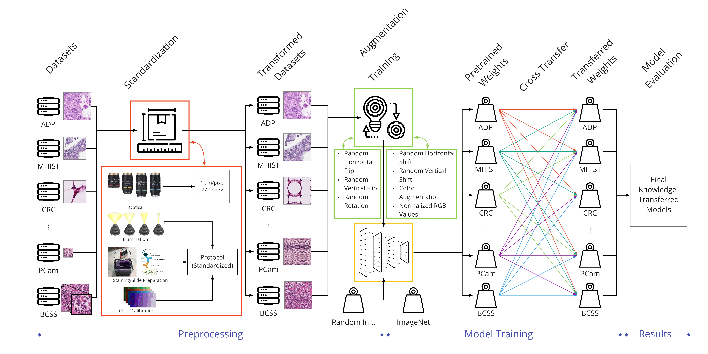

# HistoKT: Cross Knowledge Transfer in Computational Pathology

> [**HistoKT: Cross Knowledge Transfer in Computational Pathology**](link),            
> Ryan Zhang, Annie Zhu, Stephen Yang, Mahdi S. Hosseini, Konstantinos N. Plataniotis        

## Overview

In computational pathology, the lack of well-annotated datasets obstructs the application of deep learning techniques. Since pathologist time is expensive, dataset curation is intrinsically difficult. Thus, many CPath workflows involve transferring learned knowledge between various image domains through transfer learning. Currently, most transfer learning research follows a model-centric approach, tuning network parameters to improve transfer results over few datasets. In this paper, we take a data-centric approach to the transfer learning problem and examine the existence of generalizable knowledge between histopathological datasets. First, we create a standardization workflow for aggregating existing histopathological data. We then measure inter-domain knowledge by training ResNet18 models across multiple histopathological datasets, and cross-transferring between them to determine the quantity and quality of innate shared knowledge. Additionally, we use weight distillation to share knowledge between models without additional training. We find that hard to learn, multi-class datasets benefit most from pretraining, and a two stage learning framework incorporating a large source domain such as ImageNet allows for better utilization of smaller datasets. Furthermore, we find that weight distillation enables models trained on purely histopathological features to outperform models using external natural image data.

## Results

## Table of Contents

## Getting Started 

### Dependencies

### Running the Code

#### Training Parameters

#### Training Output

## Code Organization

### Configs

### Dependency Extraction

### Metrics

### Version History
* 0.1 
    * Initial Release
